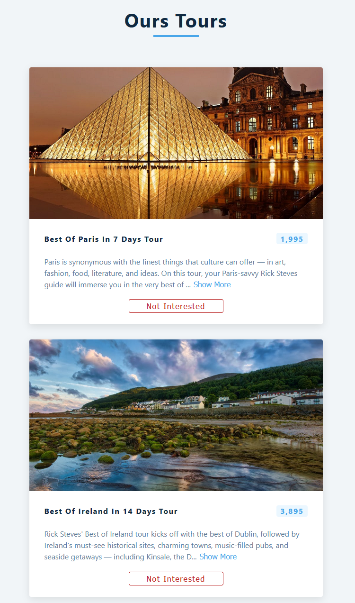

# Basic fetching data tours component
> Outline a brief description of your project.
> Live demo [_here_](http://mati99789.github.io/Tours-fetching-data). <!-- If you have the project hosted somewhere, include the link here. -->

## Table of Contents
* [General Info](#general-information)
* [Technologies Used](#technologies-used)
* [Features](#features)
* [Screenshots](#screenshots)
* [Setup](#setup)
* [Project Status](#project-status)
* [Room for Improvement](#room-for-improvement)
* [Acknowledgements](#acknowledgements)
* [Contact](#contact)
<!-- * [License](#license) -->

## General Information
- This is a basic component fetching data and use useEffect hooks to practice.
<!-- You don't have to answer all the questions - just the ones relevant to your project. -->

## Technologies Used
- React
- CSS

## Screenshots

<!-- If you have screenshots you'd like to share, include them here. -->

## Setup
Start with `npm i && npm start`

## Project Status
Project is:  _complete_.

## Room for Improvement
Include areas you believe need improvement / could be improved. Also add TODOs for future development.

To do:
- Feature to be added 1
- Feature to be added 2

## Acknowledgements
- Many thanks to my mentor  [Devmentor](https://devmentor.pl/)

## Contact
Created by [Matteus Urbniak](mailto:matteus.urbaniak@hotmail.com) - feel free to contact me!

<!-- Optional -->
<!-- ## License -->
<!-- This project is open source and available under the [... License](). -->

<!-- You don't have to include all sections - just the one's relevant to your project -->
